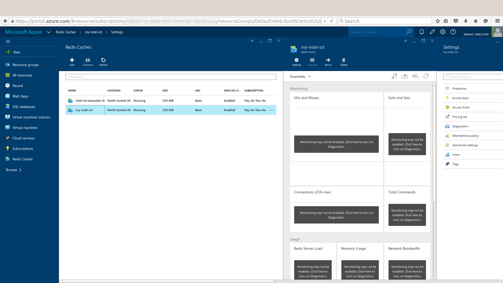
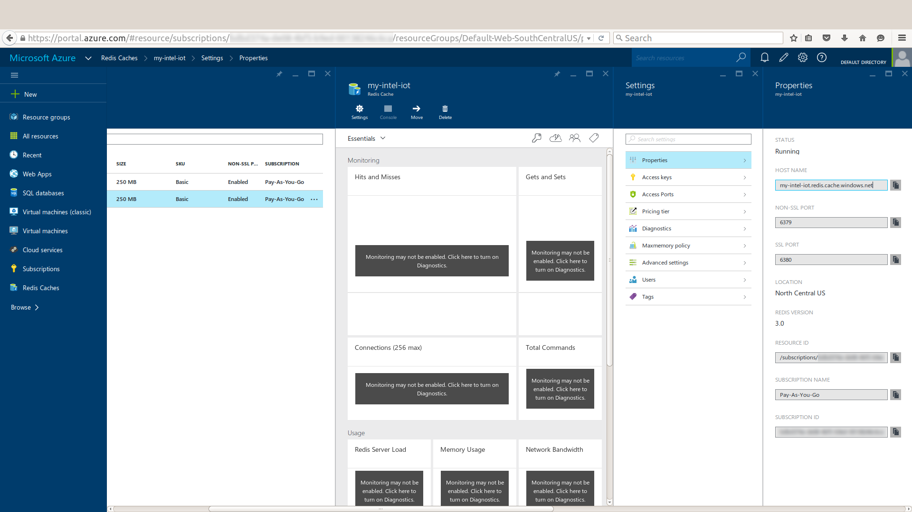
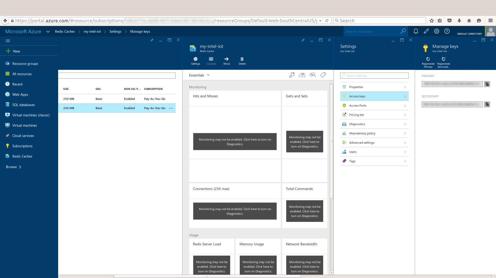
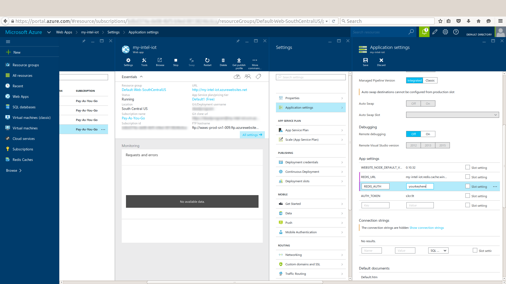
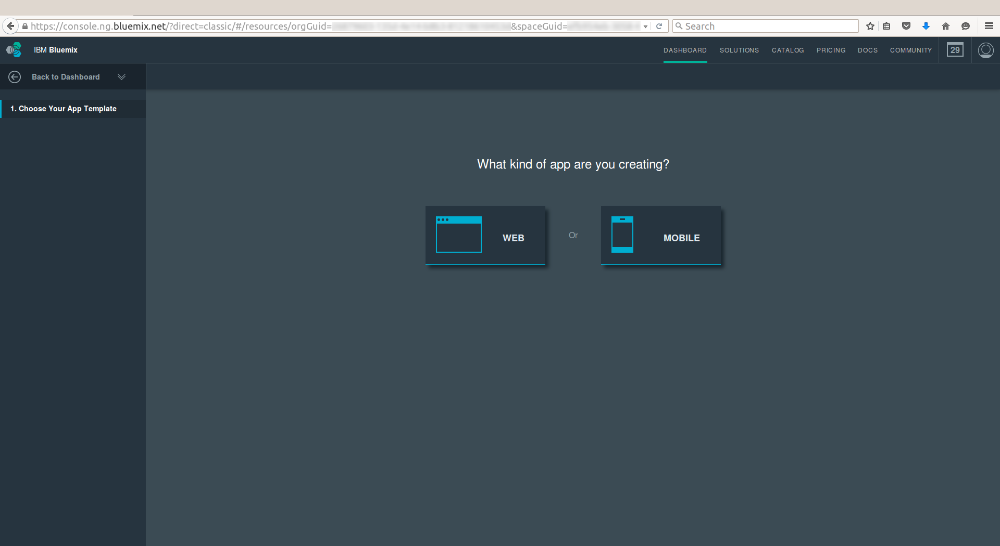
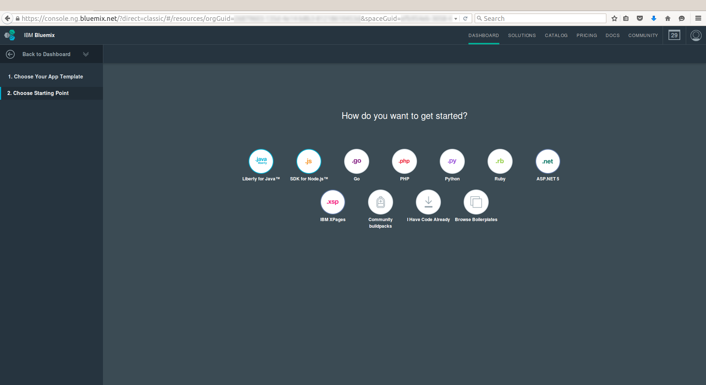
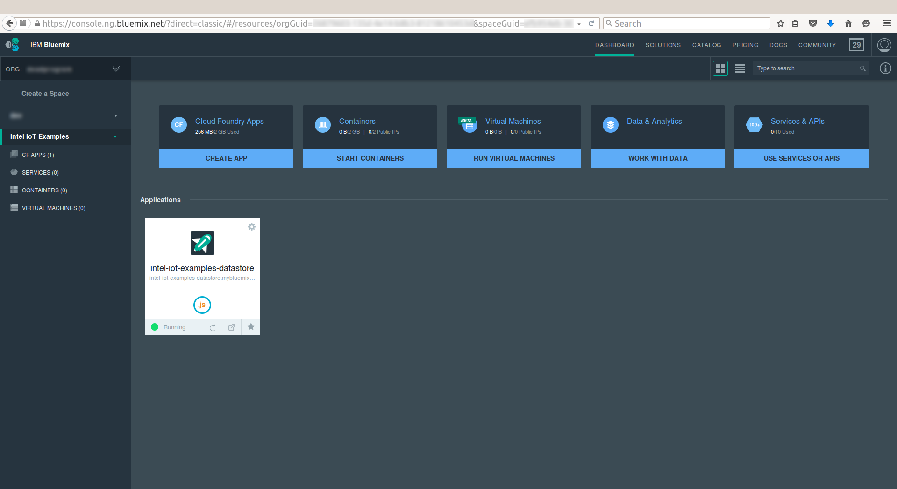

# Intel IoT Examples Datastore

The Intel IoT Examples Datastore is intended to provide a simple data store for example applications that are part of the Intel IoT Starter Kits examples.

It is a Node.js application written using [Express][]. It uses a [Redis][] data store.

Although this data storage app was developed to deploy on either Microsoft Azure or IBM Bluemix, since it is based on commonly used open source modules, it should be easy to deploy on many different cloud hosts.

[Express]: https://github.com/strongloop/express
[Redis]: http://redis.io/

## How It Works

The Intel IoT Examples Datastore application provides a simple REST API that allows authorized callers to store either log data, or incremental counter data.

It exposes two sets of routes, both using basic token authentication.

To authorize, provide the AUTH_TOKEN you set in the `X-Auth-Token` HTTP header.

Multiple clients can share the same Intel IoT Examples Datastore, by simply using a different route "key" for each application.

### Counter

The counter routes are used to increment an increasing counter.

- **GET /counter/:key** - gets the current value of a counter
- **GET /counter/:key/inc** - increments a counter by 1

### Logger

The logger routes wrap Redis lists, and are used to keep a linear backlog of values.

- **GET /logger/:key** - gets the latest value of a log
- **PUT /logger/:key** - adds a value to a log (`value` param in POST body)
- **GET /logger/:key/all** - returns all values of a log

## Local Setup

To install the app's dependencies, use NPM:

    $ npm install

You'll also need to have Redis installed.
For more info on that, see the [Redis download page](http://redis.io/download).

## Configuration

The primary configuration for the application takes the form of the following ENV vars:

- **REDIS_URL** - the URL to use for Redis communication
- **REDIS_AUTH** - authentication token for Redis backend
- **PORT** - port to serve app on (defaults to `3000`)
- **AUTH_TOKEN** - authentication token for clients to use

## Deployment  - Microsoft Azure

This guide will cover setting up a deployment environment for the Datastore on Microsoft Azure.

For other platforms, please refer to the platform documentation.

Before we begin, please ensure you have an [Azure account](https://portal.azure.com/signin/index).

### Create New Web App

Click on "New", then choose "Web + Mobile", then click "Web App".

Enter the name for your new web application.

Click on the "Create" button. Your new web application will be created.

### Create New Redis Cache

Click on "New", then choose "Data + Storage", then click "Redis Cache".

Enter the name for your new Redis cache.

Click on the "Create" button. Your new Redis cache will be created.

### Determine Settings For Redis

Click on the "Redis Caches" in the left sidebar, then click on the name of the new Redis cache you created in the previous step.

Click on "Settings" then click on "Properties". Write down or copy the "Host Name" field so you can use that value for the `REDIS_URL` setting for the web application.

Click on "Settings" then click on "Access Keys". Write down or copy the "Primary" or "Secondary" field so you can use that value for the `REDIS_AUTH` setting for the web application.

Click on "Settings" then click on "Access Ports". Click on the "Allow access only via SSL" to set it to "No". Click on the "Save" button.

### Configure Web App

Click on the "Web Apps" in the left sidebar, then click on the name of the new web application you created in the first step.

Click on "Settings" then click on "Application Settings". Scroll down to the "App Settings" section.

Enter `REDIS_URL` into the first blank "Key" field. Enter the value from "Host Name" from above in the the "Value" field.

Enter `REDIS_AUTH` into the next blank "Key" field. Enter the value from "Primary" from above into the "Value" field.

Enter `AUTH_TOKEN` into the next blank "Key" field. Enter whatever shared secret key that you want into the "Value" field.

Click on the "Save" button.

Note that you don't need to set `PORT`, as the Microsoft Azure platform will do that automatically.

### Configure Deployment Credentials

Click on the "Web Apps" in the left sidebar, then click on the name of the new web application you created in the first step.

Click on "Settings" then click on "Continuous Deployment". Click on "Choose Source", then click on "Local Git Repository". Click on the "Save" button.

Click on "Settings" then click on "Deployment Credentials". Enter a new "FTP/deployment user name" and "Password", then click on "Save".

Click on "Settings" then click on "Properties". Scroll down to display the field "Git URL". Copy the contents of the field.

### Configure Git

Now, bring up the command line in the directory you use for this repo. Run the following Git command to add the Microsoft Azure server for deployment:

    git remote add azure <GitURL>

where `<gitURL>` is the value you obtained from on the "Properties" page. Now you are ready to deploy.

### Deploy Web App

Run the following Git command:

    git push azure master

You will be prompted for the password you entered under "Deployment Credentials".

You should see output to the terminal, that ends like this:

    ...
    remote: Finished successfully.
    remote: Deployment successful.
    To https://deadprogram@my-intel-iot.scm.azurewebsites.net:443/my-intel-iot.git
      * [new branch]      master -> master

This means that your application has been deployed to the Microsoft Azure cloud.

## Deployment - IBM Bluemix

This guide will cover setting up a deployment environment for the Datastore on IBM Bluemix.

For other platforms, please refer to the platform documentation.

Before we begin, please ensure you have an [IBM Bluemix account]().

### Create New Web App

Choose the "Space" to which you want to add the new web application, or create a new one.

Click on "Create App"

Under "What kind of app are you creating?" click on "WEB".

Under "How do you want to get started?" click on "SDK for Node.js".

Click on the "Continue" button.

Under "What do you want to name your new app?" enter a new name, then click on "FINISH".

After a few moments, your new web app will be created. Click on the "Back to Dashboard" link. You will see your new web app listed there.

### Create New Redis Cache

Click on the new application you created in the previous series of steps.

Click on the "Add a service or API".

Click on "Redis Cloud" under "Data and Analytics" section.

Select a plan, then click on the "Create" button.

You may be prompted to "Restage Application", if so click on the "Restage" button.

### Configure Web App

Click on the "Overview" link to return to the "Overview" page for the new web app.

Click on the "Add Git" link located at the top right of the "Overview" page.

The "Create Git Repository" dialog will be displayed. Make sure the checkbox for "Populate the repo with the starter app package and enable the Build and Deploy pipeline" is checked, then click on the "Continue" button.

After a moment, the "Success!" message should be displayed. Click on the "Close" button.

The Git URL to the new Git repo will be displayed on the "Overview" page at the top right.

### Configure Git

Now, bring up the command line in the directory you use for this repo. Run the following Git command to add the IBM Bluemix server for deployment:

    git remote add bluemix <GitURL>

where `<gitURL>` is the value you displayed on the "Overview" page.

Now you are ready to deploy.

### Deploy Web App

To deploy your web app, run the following Git command:

    git push bluemix master -f

You will be prompted for your Bluemix username and password.

Once your git push is complete, your application has been deployed to the IBM Bluemix cloud. Please note that it may take a moment for your web app to restart.
